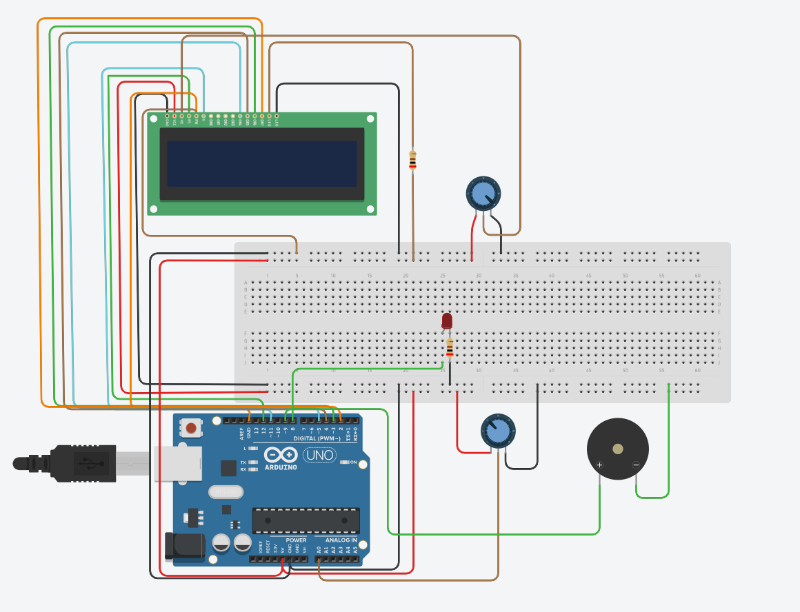

# Smart-energy-monitoring-system
## Abstract
This project presents a smart energy monitoring system using Arduino that measures an analog input (simulated current using a potentiometer), calculates power consumption, and estimates energy usage in real time. It also provides overload indication using a buzzer and LED, along with cost estimation for efficient energy management.

## Table of Contents
- Introduction
- System Overview
- Components Used
- Circuit Design
- Working Principle
- Results
- Conclusion

## Introduction
With increasing energy consumption, monitoring and managing electricity usage has become essential. This project provides a low-cost solution for real-time power monitoring and load indication using Arduino and basic electronic components.

## System Overview
The system uses a potentiometer as a simulated current source connected to the analog input of Arduino. The Arduino reads this analog value and converts it into current. Power is calculated using a fixed voltage value, and energy consumption is tracked over time using the internal timer (millis()).
The system displays real-time data such as power, energy, peak power, and cost on a 16×2 LCD. It also classifies load conditions and gives alerts during overload using a buzzer and LED.

## Components Used
- Arduino Uno
- 16x2 LCD Display
- Potentiometer
- Buzzer
- LED
- Resistors and wires

## Circuit Design

---

## Working Principle
- Arduino reads analog value from potentiometer using analogRead().This value is converted into a proportional current value
- Power is calculated using P = V × I
- Energy is calculated using time difference from millis(): Energy = Power x Time
- Energy is converted into kWh and cost is calculated using a fixed rate
- System classifies load (LOW, NORMAL, HIGH)
- If power exceeds threshold : Overload triggers buzzer and LED alert

## Results
- Real-time power variation observed using potentiometer
- Energy consumption calculated continuously
- Cost estimation displayed on LCD
- Load conditions successfully classified
- Overload condition triggered buzzer and LED alerts

---

## Conclusion
This project demonstrates a simple and effective method for monitoring electrical parameters using Arduino. It calculates power, energy consumption, and cost in real time and displays them on an LCD. The system also provides overload indication using a buzzer and LED, helping in energy management and safety.
Although a potentiometer is used to simulate current in this project, it can be extended to real-world applications by integrating a current sensor such as ACS712.
In future, this system can be improved by adding internet connectivity to monitor data remotely.
