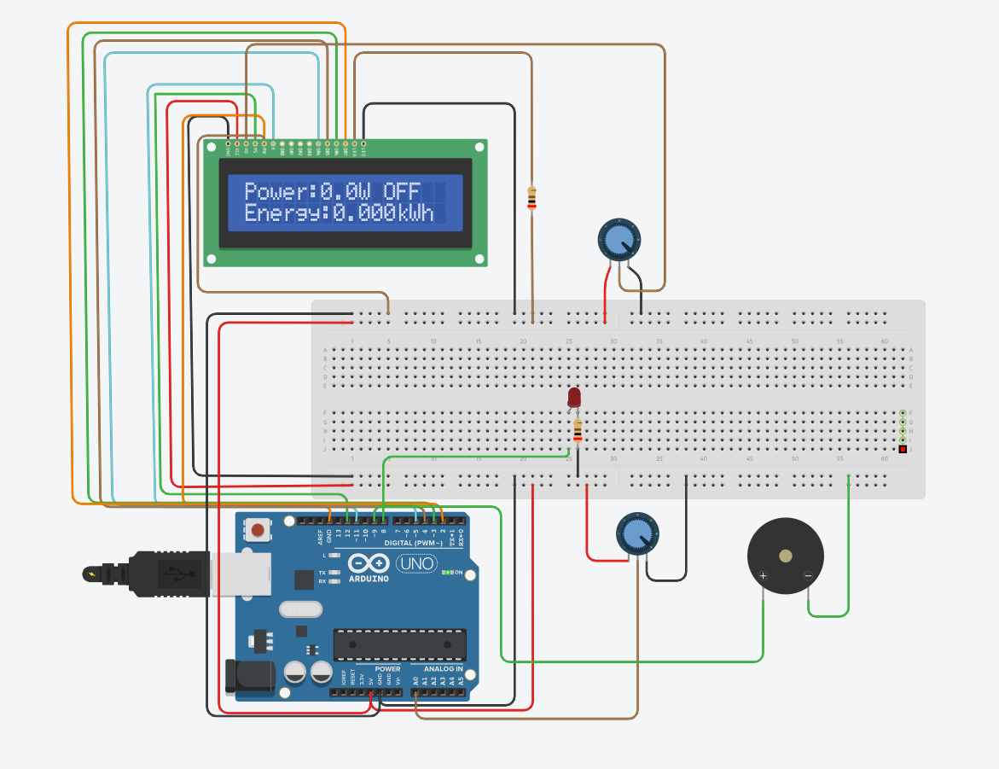
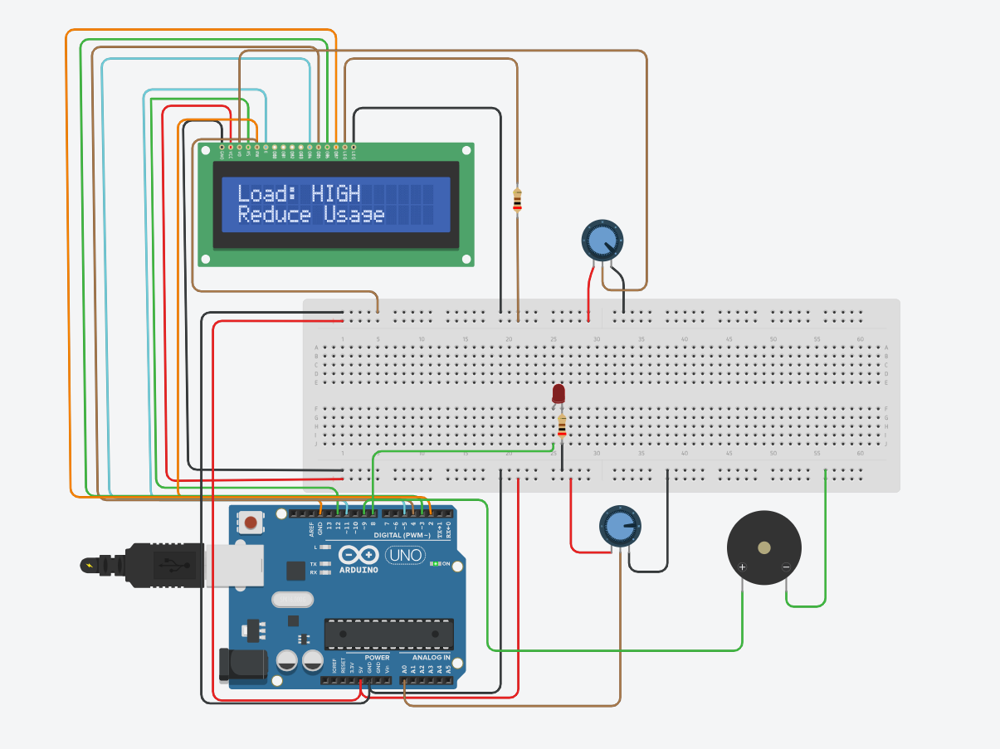
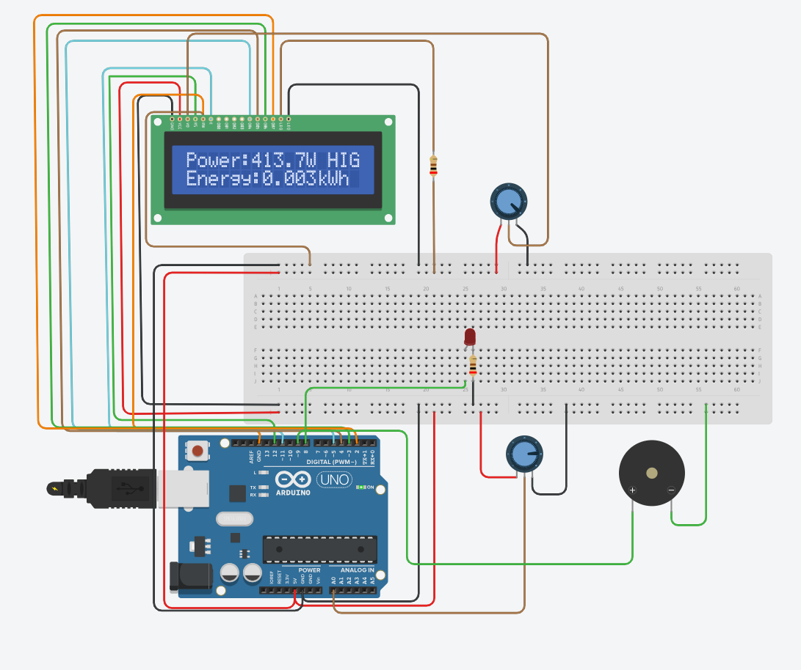
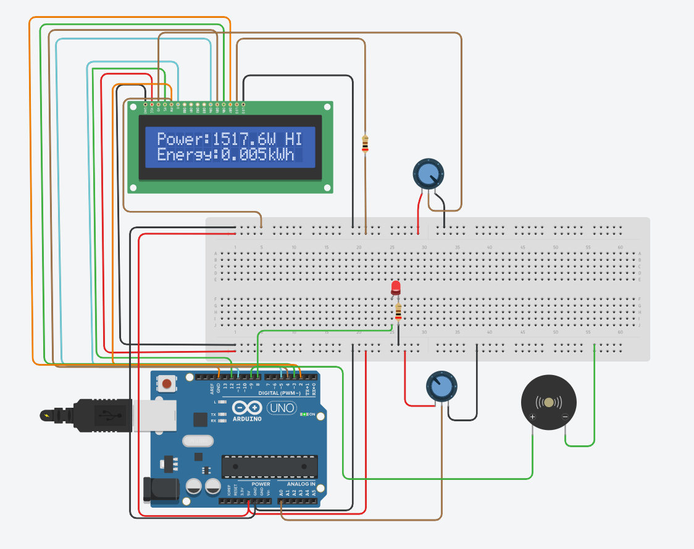
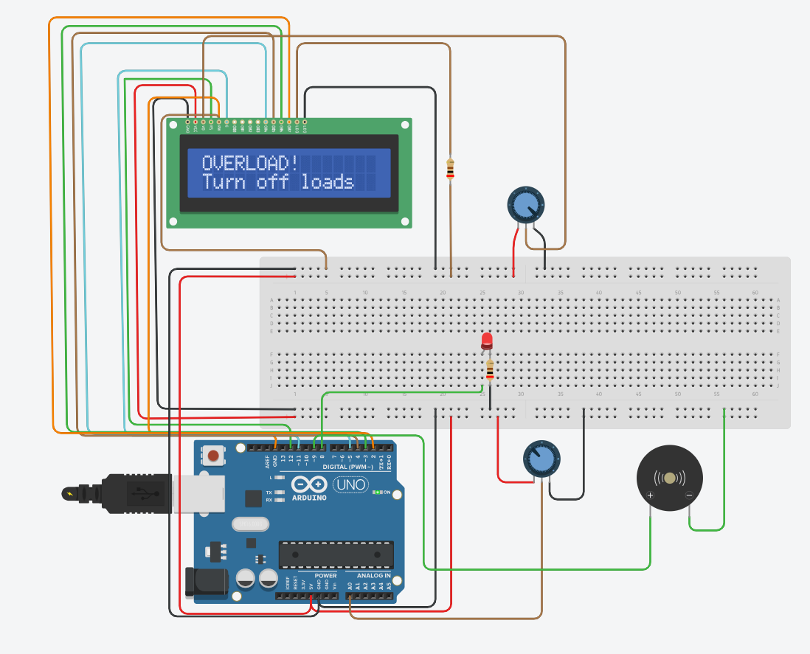

# Smart Energy Monitoring System
## Abstract
This project is based on a smart energy monitoring system using Arduino as a tool for measuring analog input (simulated current using a potentiometer), calculating power consumption, and estimating energy consumption in real time. It also provides overload indication using a buzzer and an LED, as well as cost estimation for efficient energy consumption.

## Table of Contents
- Introduction
- System Overview
- Components Used
- Circuit Design
- Working Principle
- Results
- Conclusion

## Introduction
Energy consumption is on the rise, and managing it is of utmost importance. The project provides a cost-effective solution for power monitoring and overload indication using Arduino and various electronic components.

## System Overview
The project is based on a simulated current source using a potentiometer connected in series with the analog input of Arduino. The analog input is read by Arduino and is further used to calculate current consumption. Power consumption is calculated by using a fixed voltage value, and energy consumption is calculated using the internal timer of Arduino (millis() function).

The project displays real-time data on a 16x2 LCD display and also indicates load conditions and overload using a buzzer and an LED.

## Components Used
- Arduino Uno
- 16x2 LCD Display
- Potentiometer
- Buzzer
- LED
- Resistors and wires

## Circuit Design

---

## Working Principle
- Arduino reads the analog signal from the potentiometer by using analogRead(). This signal is then converted into a proportional amount of current
- Power is computed by using the formula P = V * I
- Energy is computed by finding the time difference from the function millis(). Energy = Power * Time
- Energy is then converted into kWh format and cost is computed by assuming a fixed rate
- System classifies the load into LOW, NORMAL, and HIGH
- If the power level goes beyond the threshold, then the system sends an overload signal to the buzzer and LED

## Results
- Power variation in real time can be observed by using the potentiometer
- Energy consumption can be computed in real time
- Cost can be computed and displayed on the LCD screen
- Load conditions can be classified into LOW, NORMAL, and HIGH
- Overload conditions can send signals to the buzzer and LEDs

---
## Conclusion
The project has shown a simple way to monitor electric parameters using Arduino. It can calculate power, energy consumption, and cost in real-time and can display it on an LCD screen. It can also give an overload indication using a buzzer and LED light.
The project uses a potentiometer to sense current in this project.However, it can be further extended to a real-time application using a current sensor module ACS712.
The project can be further enhanced in the future to include internet connectivity to monitor data online.
